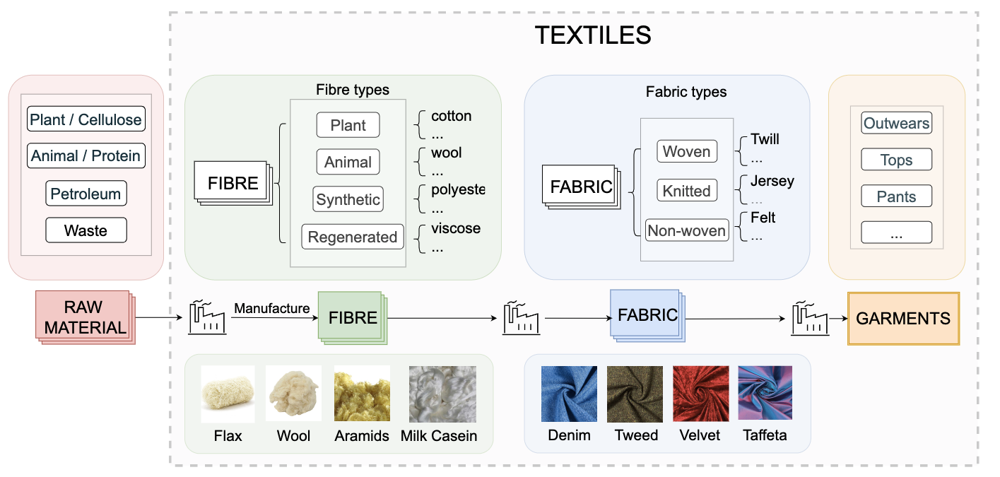

# TextileNet
We present TextileNet, a material taxonomy-based fashion textile dataset to close the gap in current research on textile material identification in clothing.

 We developed the TextileNet dataset (illustrated in the figure below) based on fibre and fabric labels. We achieved this through carefully designing two taxonomies, one for fibres and another for fabrics in close collaboration with material domain experts.



<br />
<br />

# Requirements

```bash
conda install pytorch torchvision torchaudio cpuonly -c pytorch
```

<br />
<br />

# Build the dataset

The user has to first download our dataset as a zip file from the following links either from One drive or Google drive.

* Google drive
  * [TextileNet-fibre](https://drive.google.com/file/d/1e_E9NeTs7qSuUzWszSkmK09jTHPQwdd6/view?usp=sharing)
  * [TextileNet-fabric](https://drive.google.com/file/d/1G_g3NEcluW9iKbWY6BiCMcSo0eLxCG0z/view)

* One Drive
  * [TextileNet-fibre](https://liveuclac-my.sharepoint.com/:u:/g/personal/ucabs31_ucl_ac_uk/EcEcoqBIjr9HvE4RJOcyD_YB7ZXc8ws-g5naMnlI6U-nIg)
  * [TextileNet-fabric](https://liveuclac-my.sharepoint.com/:u:/g/personal/ucabs31_ucl_ac_uk/EcEcoqBIjr9HvE4RJOcyD_YB7ZXc8ws-g5naMnlI6U-nIg)

After extracting both of the these downloaded files to a directory (say `data`), the user should have the following file structure

```bash
project
│   README.md
│
└───data
    └───fibre
        └───abaca
        │   └───a.jpeg
        │       b.jpeg
        │       ...
        └───acrylic
        └───alpaca
        │   ...
    └───fabric
        └───canvas
        │   └───a.jpeg
        │       b.jpeg
        │       ...
        └───chambray
        └───chenille
        │   ...
```

The user then have to launch our download script to add further data to these directories.
In case the user does not want a full-scale download, for testing purposes, one can run:

```bash
python prepare_data.py --parent_dir ./data/fibre --partition fibre --test --processes 4
```

For a full scale download, fill in `n` with a process count for parallel downloads.

```bash
# for fibre
python prepare_data.py --parent_dir ./data/fibre --partition fibre --processes n
# for fabric
python prepare_data.py --parent_dir ./data/fabric --partition fabric --processes n
```

<br />
<br />

# Training the baselines

Our baseline models can be trained using the following commands

* Change `--data` for fibre or fabric
* Change `--data_parent_dirt` to point to the correct parent directory for datasets

```bash
cd src

# for resnet
CUDA_VISIBLE_DEVICES=0,1,2,3 python train_resnet.py --data fibre --batch_size 512 --num_classes 33 --num_workers 32 --seed 0
# for vit
CUDA_VISIBLE_DEVICES=0,1,2,3 python train_vits.py --data fibre --batch_size 512 --num_classes 33 --num_workers 32 --seed 0
```


<br />
<br />

# Trained Baselines

* The baselines can also be downloaded from:
  * [TextileNet-fibre + ResNet18](./baselines/TextileNet-fibre/res18_ckpt.pth) 
  * [TextileNet-fibre + Vision Transformer(ViT)](./baselines/TextileNet-fibre/vits_ckpt.pth) 
  * [TextileNet-fabric + ResNet18](./baselines/TextileNet-fabric/resnet18_ckpt.pth)
  * [TextileNet-fabric + ViT](./baselines/TextileNet-fabric/vits_ckpt.pth)


* The TextileNet labels and class ids:
  * [TextileNet-fibre labels](./labels/fibre_label.txt) 
  * [TextileNet-fabric labels](./labels/fabric_label.txt)


We report their top-1 and top-5 accuracy, more details are in the paper:

| Dataset Partition |  Network    | Accuracy (top1/5)    |
| ----------- | ----------- | --------- |
| TextileNet-fibre      | Resnet50    |  49.74±0.27 / 87.32±0.14    |
| TextileNet-fibre   | ViT       |  53.32±0.64 / 88.46±0.26         |
| TextileNet-fabric      | Resnet50    |  65.28±0.67 / 90.36±0.31    |
| TextileNet-fabric   | ViT        |   67.32±0.45 / 92.12±0.26        |


<br />
<br />


# CITATION
```
@article{zhong2023textilenet,
  title={TextileNet: A Material Taxonomy-based Fashion Textile Dataset},
  author={Zhong, Shu and Ribul, Miriam and Cho, Youngjun and Obrist, Marianna},
  journal={arXiv preprint arXiv:2301.06160},
  year={2023}
}
```

# LICENCE
The data collection code is released with the MIT license. 
For TextileNet dataset, the author has applied a Creative Commons Attribution (CC BY) licence to any Author Accepted Manuscript version arising. 
